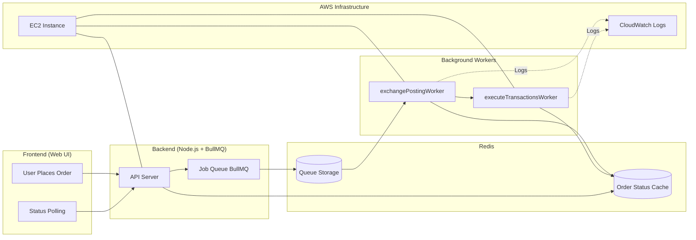
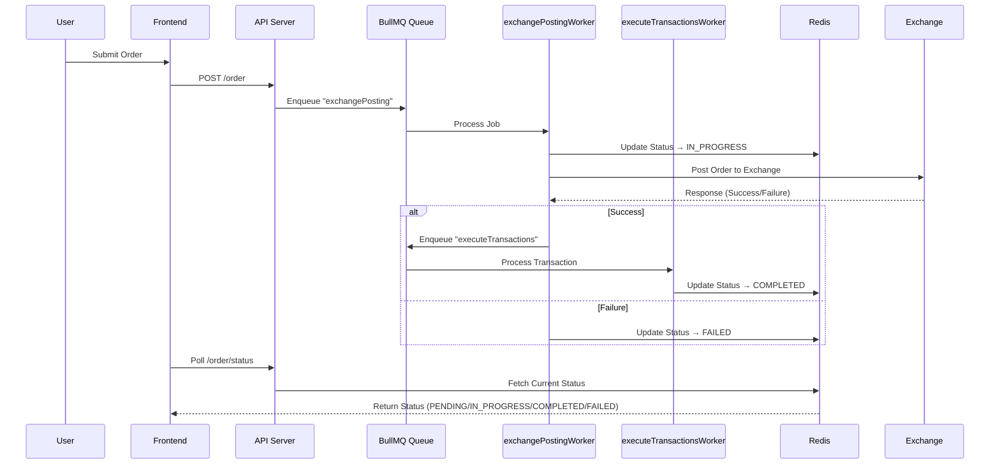
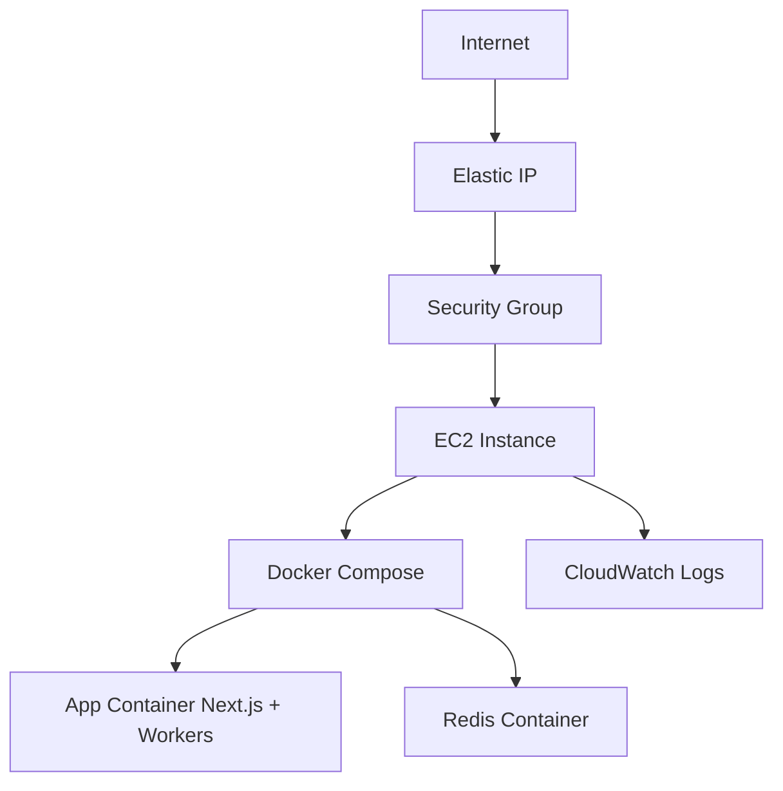

# Apex Crypto Exchange Platform

Order processing system for cryptocurrency exchanges — featuring asynchronous job queues, retry logic, and real-time status tracking.

---

## Table of Contents

1. [Background: The Original Problem](#background-the-original-problem)  
2. [Solution Overview](#solution-overview)  
3. [System Architecture](#system-architecture)  
4. [Order Processing Flow](#order-processing-flow)  
5. [BullMQ Workers & Redis](#bullmq-workers--redis)  
   - [Worker Code Review](#worker-code-review)
   - [Worker Logging](#worker-logging)
   - [Worker Event Handling](#worker-event-handling)
6. [Redis Usage](#redis-usage)  
7. [Testing](#testing)  
8. [CI/CD: GitHub Actions](#cicd-github-actions)  
9. [AWS Infrastructure & IaC](#aws-infrastructure--iac)  
10. [Final Notes](#final-notes)

---

## Background: The Original Problem

The initial order processing implementation ran **synchronously**, making direct API calls to external exchange services.  
This caused several reliability and user experience issues:

- **Random API Failures**: Transient network or third-party outages caused order failures.  
- **No Retries**: Failed requests weren’t retried, leading to inconsistent results.  
- **Hard Debugging**: Failures were difficult to troubleshoot or fix.

---

## Solution Overview

Key improvements implemented in this version:

- **Asynchronous Processing** — Orders are queued and handled in the background.  
- **BullMQ Queues** — Job queues with retry and exponential backoff support.  
- **Dedicated Workers** — Handle API calls, status updates, and error management.  
- **Redis Integration** — Used for queue storage and order state management.  
- **Frontend Polling** — Real-time order status updates for users.  
- **Full Observability** — Structured logs and metrics for debugging and monitoring.

---

## System Architecture


---

## Order Processing Flow



---
## BullMQ Workers & Redis
### Worker Code Review
1. exchangePostingWorker
     - Purpose: Handles posting the order to the exchange.
     - Retries: Up to 3 attempts with exponential backoff.
    -  Status Flow: IN_PROGRESS → FAILED (on error).
    -  Chaining: On success, triggers executeTransactionsWorker.

2. executeTransactionsWorker
    - Purpose: Executes the actual crypto transaction.
    - Retries: Up to 3 attempts with exponential backoff.
    - Status Flow: IN_PROGRESS → COMPLETED or FAILED.

### Worker Logging

All worker logs are written to:

```
/var/log/worker.log
```

Logs are available in both:
 - CloudWatch
 - Host system (via Docker volume mapping)

### Worker Event Handling

Both workers subscribe to BullMQ events (e.g., completed, failed) for:
 - Status transitions
 - Retry scheduling
 - Logging and error reporting

 ---

 ## Redis Usage    
|   Purpose             |   Description                                                                         |
|-----------------------|---------------------------------------------------------------------------------------|
|   **Queues**          |   BullMQ stores all job data, states, and retry metadata.                             |
|   **Order Status**    |	Each order’s state is stored as order:<id>:status.                                  |
|   **Separation**      |	Two separate Redis connections — one for queueing, one for order status tracking.   |

---
## Testing
### What's Tested: Explicit Test Mapping

This section details all automated tests in the project, specifying for each:
- **Type:** Unit or integration test
- **Mocks:** Which functions or modules are mocked
- **Real Infrastructure:** Which parts use real Redis, BullMQ, or worker processes
- **File Reference:** Where to find the test

---

#### Frontend Unit Tests (`src/app/__tests__/OrderPage.test.tsx`)

#### 1. shows completion message when order succeeds and status is completed
- **Type:** Unit test (React component)
- **Mocks:** All TRPC API calls (`api.order.create.useMutation`, `api.order.getStatus.useQuery`)
- **Real Infra:** None (all network/data is mocked)
- **File:** [`src/app/__tests__/OrderPage.test.tsx`](src/app/__tests__/OrderPage.test.tsx)

#### 2. shows retry message when order succeeds but status is failed
- **Type:** Unit test (React component)
- **Mocks:** All TRPC API calls (`api.order.create.useMutation`, `api.order.getStatus.useQuery`)
- **Real Infra:** None
- **File:** [`src/app/__tests__/OrderPage.test.tsx`](src/app/__tests__/OrderPage.test.tsx)

---

#### Backend Integration Tests (`src/server/api/__tests__/orderQueue.test.tsx`)

#### 3. processes the full order queue flow and completes
- **Type:** Integration test
- **Mocks:** Only external API calls (`createExchangePosting`, `executeTransactions`)
- **Real Infra:** Real Redis, real BullMQ queues, real worker processes, real status updates
- **File:** [`src/server/api/__tests__/orderQueue.test.tsx`](src/server/api/__tests__/orderQueue.test.tsx)

#### 4. retries failed exchange posting and completes on retry
- **Type:** Integration test
- **Mocks:** Only external API calls (`createExchangePosting` fails first, then succeeds; `executeTransactions`)
- **Real Infra:** Real Redis, real BullMQ queues, real worker processes, real status updates
- **File:** [`src/server/api/__tests__/orderQueue.test.tsx`](src/server/api/__tests__/orderQueue.test.tsx)

---

#### Backend Integration Tests (`src/server/api/__tests__/queueFlow.test.tsx`)

#### 5. should add jobs to queue and verify they can be processed
- **Type:** Integration test
- **Mocks:** Only external API call (`createExchangePosting`)
- **Real Infra:** Real Redis, real BullMQ queues
- **File:** [`src/server/api/__tests__/queueFlow.test.tsx`](src/server/api/__tests__/queueFlow.test.tsx)

#### 6. should respect job options and retry configuration
- **Type:** Integration test
- **Mocks:** None (no external calls in this test)
- **Real Infra:** Real Redis, real BullMQ queues
- **File:** [`src/server/api/__tests__/queueFlow.test.tsx`](src/server/api/__tests__/queueFlow.test.tsx)

#### 7. should handle queue cleanup properly
- **Type:** Integration test
- **Mocks:** None
- **Real Infra:** Real Redis, real BullMQ queues
- **File:** [`src/server/api/__tests__/queueFlow.test.tsx`](src/server/api/__tests__/queueFlow.test.tsx)

---

### Summary Table

| Test Description                                               | File                                      | Type         | Mocks                                 | Real Infra Used         |
|---------------------------------------------------------------|-------------------------------------------|--------------|---------------------------------------|------------------------|
| shows completion message (order completed)                     | OrderPage.test.tsx                        | Unit         | All TRPC API calls                    | None                   |
| shows retry message (order failed)                             | OrderPage.test.tsx                        | Unit         | All TRPC API calls                    | None                   |
| processes full order queue flow                                | orderQueue.test.tsx                       | Integration  | External API calls                    | Redis, BullMQ, Workers |
| retries failed exchange posting and completes on retry         | orderQueue.test.tsx                       | Integration  | External API calls                    | Redis, BullMQ, Workers |
| should add jobs to queue and verify they can be processed      | queueFlow.test.tsx                        | Integration  | External API call                     | Redis, BullMQ          |
| should respect job options and retry configuration             | queueFlow.test.tsx                        | Integration  | None                                  | Redis, BullMQ          |
| should handle queue cleanup properly                           | queueFlow.test.tsx                        | Integration  | None                                  | Redis, BullMQ          |

---

## CI/CD: GitHub Actions
### Check Workflow

- Trigger: On every pull request
- Steps:
    1. Install dependencies
    2. Typecheck
    3. Lint
    4. Run tests
    5. Build the code

### Deploy Workflow

- Trigger: On push to development branch
- Steps:
    1. Build Docker image and push to AWS ECR
    2. Use AWS SSM to update EC2 environment
    3. Restart containers with new version

---

## AWS Infrastructure & IaC
### Terraform

- VPC / Subnets / Security Groups — Secure, isolated network setup

- EC2 Instance — Hosts Docker Compose stack (App + Redis)

- Elastic IP — Provides static public IP

- IAM Role — Permissions for SSM and CloudWatch

- CloudWatch Log Group — Collects logs from deployment and workers

### Docker Compose

- Defines multi-container services (app + workers and Redis).

### User Data Script

- Installs:

    - Docker

    - Docker Compose

    - CloudWatch Agent

- Configures:

    - /var/log/worker.log for persistent logs

    - Container startup and health checks

### Cloud Infrastructure Diagram


---
## Final Notes

- Workers & Redis — Designed per BullMQ best practices.

-  Logging — Centralized, structured, and integrated with CloudWatch.

- Testing — Backend and frontend both covered with integration + unit tests.

- CI/CD & IaC — Fully automated, reproducible deployment pipeline.

